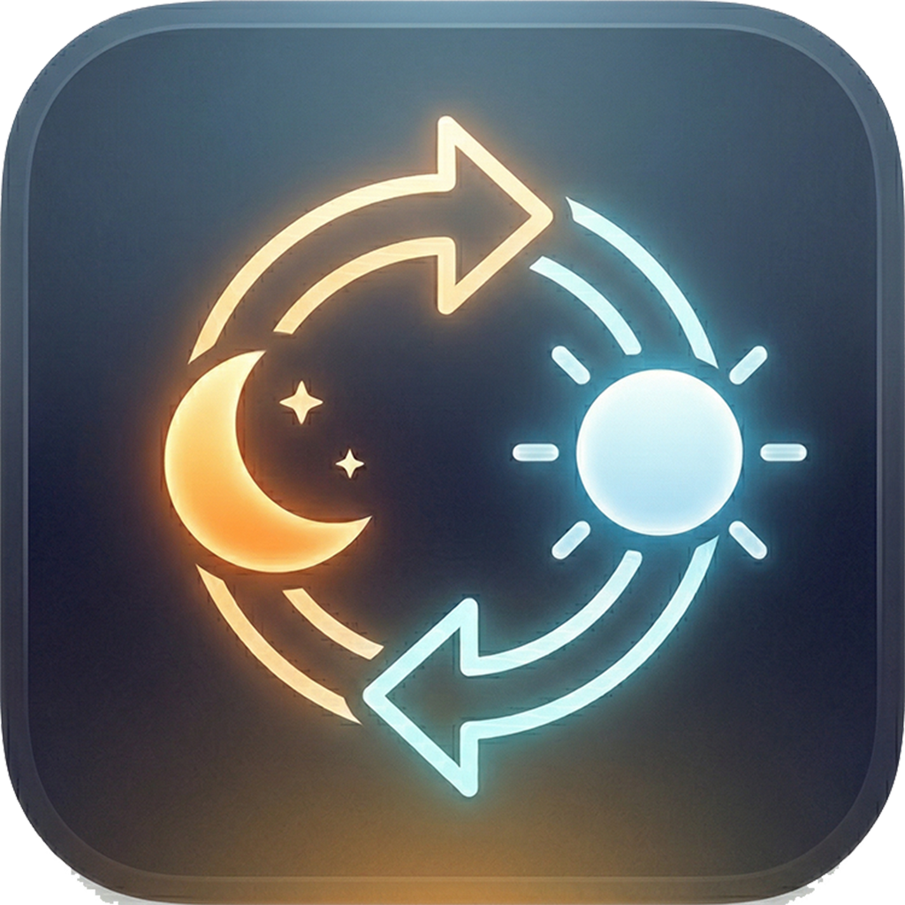

<p align="center">
  
</p>

<h1 align="center">ShiftChange</h1>

<p align="center">
  <strong>Automatically disable Night Shift for specific apps on macOS</strong>
</p>

<p align="center">
  <a href="https://adamdexter.net/">adamdexter.net</a> &nbsp;&bull;&nbsp;
  <a href="https://buymeacoffee.com/adamdexter">Buy Me a Coffee</a>
</p>

---

Night Shift is great for reducing eye strain, but it wreaks havoc on color-critical work. If you use Photoshop, Lightroom, Premiere Pro, DaVinci Resolve, or any other app that depends on accurate color, you've probably been manually toggling Night Shift on and off dozens of times a day.

**ShiftChange** fixes this. It lives in your menu bar, monitors which app is in focus, and instantly disables Night Shift when you switch to an app on your exclude list. When you switch away, Night Shift comes right back. No manual toggling, no forgetting, no more editing photos under an orange tint.

## How It Works

1. Add color-critical apps to your **Exclude List**
2. ShiftChange runs silently in the menu bar
3. When an excluded app gains focus, Night Shift is disabled automatically
4. When you switch to any other app, Night Shift is restored to its normal schedule

That's it. Set it and forget it.

## Screenshots

<p align="center">
  
</p>
<p align="center"><em>Menu bar — see Night Shift status and active app at a glance</em></p>

<br>

<p align="center">
  
</p>
<p align="center"><em>Build your exclude list — search and add apps with one click</em></p>

<br>

<p align="center">
  
</p>
<p align="center"><em>Search by app name or bundle ID to quickly find what you need</em></p>

<br>

<p align="center">
  
</p>
<p align="center"><em>Add custom application folders — useful for apps on external drives</em></p>

## Features

- **Per-app Night Shift control** — disable Night Shift only when specific apps are in focus
- **Menu bar app** — runs quietly out of the way with a status icon
- **Instant switching** — Night Shift toggles the moment you switch apps, no delay
- **Smart restore** — respects your existing Night Shift schedule; restores it when you leave an excluded app
- **Search & browse** — find apps by name or bundle ID, or manually browse for `.app` bundles
- **Custom folders** — scan additional directories for apps (external drives, non-standard installs)
- **Launch at Login** — start automatically so you never have to think about it
- **Lightweight** — native Swift, no Electron, no background web processes
- **Privacy-respecting** — no network calls, no analytics, no data collection

## Installation

### Download the DMG

1. Download the latest `ShiftChange-x.x.x.dmg` from [Releases](../../releases)
2. Open the DMG and drag **ShiftChange** to your **Applications** folder
3. Launch ShiftChange — it will appear in your menu bar
4. Add your color-critical apps to the exclude list

### Build from Source

Requires **macOS 13+** and **Swift 5.9+**.

```bash
git clone https://github.com/adamdexter/shiftchange.git
cd shiftchange/ShiftChange
swift build -c release
```

The binary will be at `.build/release/ShiftChange`.

To build a distributable `.dmg`:

```bash
./scripts/create-dmg.sh 1.0.0
```

## Requirements

- macOS 13 (Ventura) or later
- Night Shift-capable Mac (most Macs from 2012 onward)

## Who Is This For?

Anyone who uses Night Shift **and** works with color-sensitive applications:

- **Photographers** — Lightroom, Photoshop, Capture One
- **Video editors** — Premiere Pro, DaVinci Resolve, Final Cut Pro
- **Designers** — Illustrator, Figma, Sketch, Affinity Designer
- **3D artists** — Blender, Cinema 4D, After Effects
- **Developers** — when previewing designs or working on UI

## How It Works (Technical)

ShiftChange uses Apple's private `CoreBrightness` framework (`CBBlueLightClient`) to control Night Shift programmatically. It monitors `NSWorkspace.didActivateApplicationNotification` to detect app focus changes and toggles Night Shift accordingly.

The app runs as a menu bar accessory (`LSUIElement`) with no Dock icon during normal operation. The settings window activates the Dock icon temporarily for a natural macOS experience.

## Credits

Made out of necessity and with love by [Adam Dexter](https://adamdexter.net/) and [Claude Code](https://claude.ai/code).

---

<p align="center">
  If ShiftChange has been useful to you, consider
  <a href="https://buymeacoffee.com/adamdexter">buying me a coffee</a>!
</p>
</content>
</invoke>